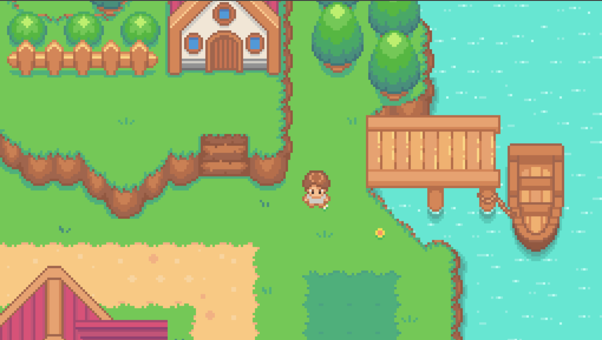
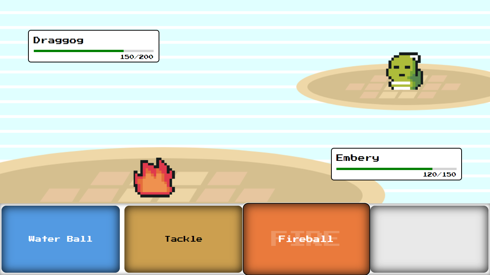

# Fight-Em-All

A Pokemon Inspired game. Fight with monsters by walking on tall grasses!

#### Play Project

After cloning the project, run the following commands to start the project.

Install dependencies 
> pnpm install

Play the GAME!!
>pnpm play

#### Software Needed

In case you need to make changes to map you will need the following softwares:

- [Tiled Editor](https://www.mapeditor.org/)

#### Future Plans

You can also contribute in this game by extending many features you can think of!! Some of them can be:

- Adding more monsters
- Adding more move
- Deal damage according to type of move used
- Include more animation for attacks
- Include player battles
- Online mode!!
- Bigger Map? New cities, villages.
